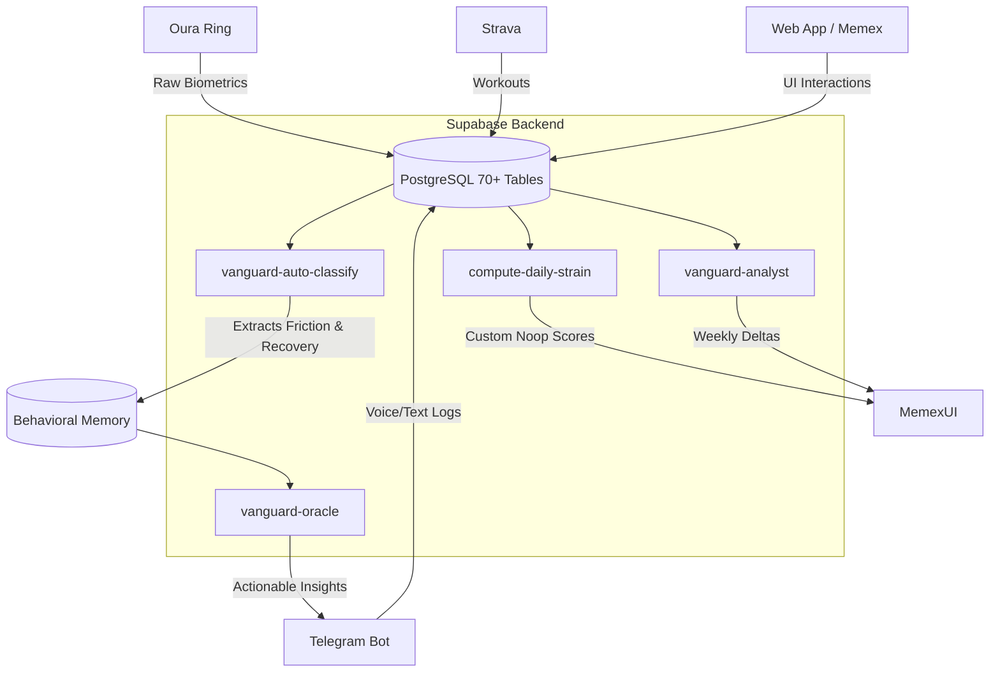

# Vanguard OS

> **A personal operating system built for one person.** Not a productivity app. Not a wellness tracker. A continuous behavioral memory system that turns daily action into signal — and signal into better decisions.

Built solo. Running daily. 

---

## 🌌 The Core Philosophy: "Everything Sees Itself"

Most life-tracking apps live in silos. Oura knows your HRV, Strava knows your running pace, and your Todo app knows your tasks. **They don't talk to each other. Vanguard does.**

In Vanguard OS, everything is interconnected. Your daily recovery score knows if you hit your *5 Tasks a Day*. Your food logging engine adjusts based on the training load from Strava. The AI Oracle understands when you are entering a "Downward Spiral" because it sees the correlation between your late sleep, missed tasks, and elevated friction events. It is a holistic, self-aware system.

---

## 🏗️ Architecture & How It Connects

Vanguard operates on a dual-layer architecture: **Passive Inputs** (automated data syncs) and **Active Inputs** (your manual logs and voice notes).



### Tech Stack
- **Frontend:** React 19 + TypeScript + Vite + TailwindCSS 4 (SPA on Vercel)
- **Backend:** Supabase (PostgreSQL, Auth, RLS, pg_cron)
- **Edge Compute:** Deno Edge Functions (30+ specialized microservices)
- **AI Brain:** DeepSeek v4 Flash (for structured extraction and Oracle reasoning)
- **Interfaces:** Telegram (primary quick-capture) + Web Dashboard (deep work)

---

## 🧠 Key Features & Modules

### 1. The Memex Layer (UI & Compiled Memory)
Inspired by Vannevar Bush's concept of the Memex, this is the visual hub of Vanguard. It moves away from static dashboards into a dynamic **Timeline of Cards and Widgets**. It compiles your fragmented life data into coherent "compiled memory pages," allowing you to browse your life chronologically or by entity (projects, habits, people). It features a Magazine Bar for daily reading and advanced Stats & Insights that overlay your biometric data with your behavioral patterns.

### 2. Custom "Noop" Algorithms (Biometrics & Strain)
We don't blindly trust generic, black-box scores from wearables. Vanguard takes raw data from Oura (HRV, Resting Heart Rate, Body Temperature, Sleep Stages) and runs it through **Custom Noop Algorithms**. These algorithms recalculate your actual readiness and daily strain tailored specifically to *your* context (e.g., marathon training, targeted body composition goals). If Oura says you're fully recovered but your CNS load from recent heavy lifting is peaking, Vanguard's Noop algorithm will tell you the truth.

### 3. PowerList (5 Tasks a Day)
Forget endless to-do lists that cause decision paralysis. Vanguard enforces a strict **5 Tasks a Day** rule. This module forces ruthless prioritization. The system tracks your completion rate and correlates it with your biometric readiness — answering questions like *"Do I fail my PowerList more often when my HRV drops?"*

### 4. Frictionless Food & Training Logging
- **Nutrition:** Log meals in natural language via Telegram (`/posilek zjadłem 200g kurczaka z ryżem`). Vanguard parses it, looks up macros, and feeds it into the `vanguard-nutrition-coach` which dynamically calculates your protein/calorie targets based on that day's training volume.
- **Training:** Atomic, detailed workout logging (exercises, sets, reps, kg, RPE, RIR). The data immediately impacts your CNS load score and recovery demands for the next 48 hours.

### 5. Continuous Behavioral Memory (Friction & Recovery)
Vanguard listens to your daily voice notes and stream of consciousness. The `vanguard-auto-classify` pipeline extracts:
- **Friction Events:** Procrastination, avoidance, time loss.
- **Recovery Anchors:** Moments you broke a bad habit, pushed through resistance, or executed an *adaptive move*.
The system detects State Transitions (e.g., identifying when you are in a "Downward Spiral" or building "Momentum") and provides Weekly Deltas to measure real progress.

### 6. Research & Development (Interventional Learning)
Vanguard acts as a personal R&D lab. You can declare an intervention (e.g., *"Starting today, no screens after 22:00"*). Vanguard will track the **Outcome Continuity**—measuring exactly how this specific rule impacts your sleep architecture, friction events, and task completion over the next 14 days.

---

## 📂 Directory Structure

```text
vanguard-os/
├── src/                    # Frontend Web App (React 19, Vite, Tailwind 4)
│   ├── components/         # UI Components (Memex Cards, Widgets, Chat)
│   ├── lib/                # Frontend utilities and Supabase clients
│   └── styles/             # Design system and Tailwind configuration
├── supabase/
│   ├── functions/          # Deno Edge Functions (The AI & Logic Brain)
│   │   ├── vanguard-oracle/          # Conversational AI agent
│   │   ├── vanguard-auto-classify/   # NLP parser for friction & recovery
│   │   ├── vanguard-analyst/         # Nightly pattern recognition cron
│   │   ├── compute-daily-strain/     # Custom Noop algorithms for Oura data
│   │   └── _shared/                  # Shared core logic (time, DB, LLM)
│   └── migrations/         # PostgreSQL schema and DB migrations
├── docs/                   # Documentation (Architecture, Principles)
│   ├── ARCHITECTURE.md     # System design and data flow
│   ├── PRODUCT_PRINCIPLES.md # The unshakeable laws of the Vanguard AI
│   └── VISION_10_10.md     # The end-game vision for the system
├── scripts/                # CI/CD, deployment, and ops utilities
└── AGENTS.md               # Constitution for AI agents working in this repo
```

---

## 🛠️ Getting Started

To spin up your own instance of Vanguard OS:

1. **Clone the repo:**
   ```bash
   git clone https://github.com/jcob2276/vanguard-os.git
   cd vanguard-os
   ```
2. **Install dependencies:**
   ```bash
   npm install
   ```
3. **Configure Environment:**
   Copy `.env.example` to `.env` and fill in your Supabase URL, Anon Key, Service Role Key, Telegram Bot tokens, and DeepSeek API keys.
4. **Run the Web App:**
   ```bash
   npm run dev
   ```
5. **Deploy Edge Functions:**
   ```bash
   supabase functions deploy
   ```

---

## 📜 Core Guardrails (The Constitution)
Vanguard is bound by a strict set of rules defined in `AGENTS.md` and `PRODUCT_PRINCIPLES.md`:
1. **Evidence Layer ≠ Reasoning Layer:** The AI reads evidence, but it never alters the factual logs without human confirmation.
2. **No Psychoanalysis:** The system measures behavior, it does not invent psychological narratives.
3. **User Correction is Signal:** If the user rejects an AI insight, it's not a failure—it's highly valuable data that corrects the system's trajectory.

---

*This is a personal system built for a specific lifestyle. If you're building a life-tracking data layer or a behavioral memory OS, feel free to steal the architecture, prompts, and patterns.*
