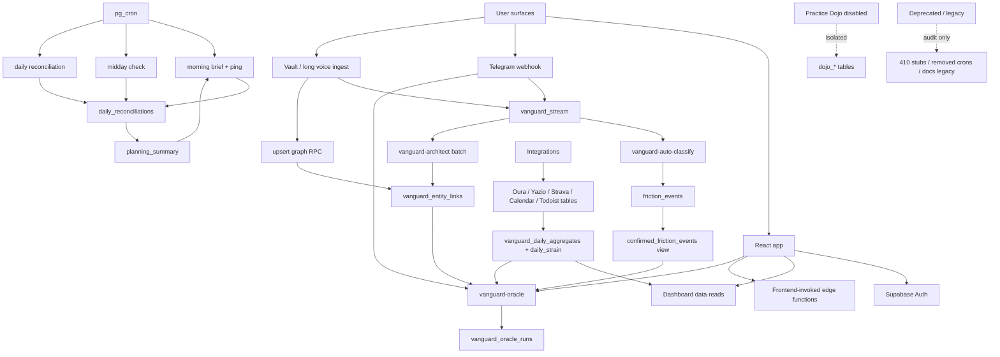

# Vanguard segmentation and audit map

Purpose: split the app into small verification units so bugs, dead structures, duplicate paths, and stale docs can be reviewed without trying to hold the whole repo in memory.

Sources used: `AGENTS.md`, `docs/ARCHITECTURE.md`, `supabase/functions/README.md`, `scripts/ops/smoke-manifest.mjs`, `src/App.jsx`, `src/components/Dashboard.jsx`, static file/import scan.

## System map

## Segment 1: Frontend shell and navigation

Scope:
- `src/App.jsx`
- `src/components/Dashboard.jsx`
- `src/store/useStore.js`
- `src/hooks/useDashboardData.js`
- `src/lib/supabase.js`

Subsegments:
- Auth gate: Supabase session load and auth state subscription.
- Dashboard routing: `mirror`, `body`, `progress`, `photos`, `fundament`.
- Shared dashboard data hook: nutrition, daily wins, workout status, Oura, computed state.
- Sync controls: Yazio and Calendar fetches.

Verify:
- Each visible tab has exactly one owner component and no orphaned view id.
- Session user id is applied consistently on reads; watch queries missing `.eq('user_id', session.user.id)`.
- Loading and error states are visible enough to avoid silent empty dashboards.
- Frontend direct `fetch('/functions/v1/...')` calls match function JWT requirements.

Resolved during cleanup:
- `Dashboard.jsx` still contains Google Calendar OAuth code inline; verify this belongs in dashboard shell, not a dedicated integration component.
- StayFree mock data was removed from active frontend/shared aggregate paths. Digital aggregate fields remain nullable historical columns.

## Segment 2: Frontend feature panels

Scope by view:
- Mirror: `AIInsight.jsx`, `IntentionTracker.jsx`, `PowerList.jsx`, `WorkoutLogger.jsx`.
- Body: `Stats.jsx`, `DailyStrainCard.jsx`, `OuraWidget.jsx`, `StravaWidget.jsx`.
- Progress: `Direction.jsx`.
- Photos: `Photos.jsx`, `MuscleHeatmap.jsx`.
- Fundament: `Fundament.jsx`, `IdentityVault.jsx`, `DataHub.jsx`, `TodoistSync.jsx`, `BrainHealth.jsx`.
- Hidden or currently not routed from dashboard: `ThoughtStream.jsx`, `GraphMind.jsx`, `MentorChat.jsx`, `OuraEnhanced.jsx`, `AWImporter.jsx`, `LocationTracker.jsx`, `ManifestationBoard.jsx`.

Largest review targets:
- `Stats.jsx` ~1273 LOC: export/reporting/data aggregation. Split audit by data source toggles, chart rendering, export generation, and empty/error branches.
- `Direction.jsx` ~647 LOC: goals, habits, weekly review, state computation. Split audit by table.
- `WorkoutLogger.jsx` ~584 LOC: workout RPC path. Split audit by local form state, previous set fetch, `save_workout_atomic` payload, post-save refresh.

Verify:
- For every component, list tables read/write and confirm migrations or known pre-existing schema.
- Components not routed from `Dashboard.jsx` should be marked one of: intentionally hidden, legacy, or delete candidate.
- Components with direct function invokes should have visible errors and retry behavior.

Dead-structure candidates:
- Deleted in working tree: `ProgressionTable.jsx`, `WorkoutExecution.jsx`, `useStats.js`, `workoutPlan.js`. Confirm no imports before final removal.
- `GraphMind.jsx`, `MentorChat.jsx`, `ThoughtStream.jsx`, `OuraEnhanced.jsx`, `AWImporter.jsx`, `LocationTracker.jsx`, `ManifestationBoard.jsx` are present but not mounted by current dashboard shell. They may be reusable, but they are audit candidates.

## Segment 3: Daily loop cron functions

Scope:
- `supabase/functions/vanguard-morning-brief/index.ts`
- `supabase/functions/vanguard-morning-ping/index.ts`
- `supabase/functions/vanguard-midday-check/index.ts`
- `supabase/functions/vanguard-daily-reconciliation/index.ts`
- `supabase/functions/vanguard-weekly-synthesis/index.ts`
- `supabase/functions/vanguard-friction-qa/index.ts`
- `supabase/functions/vanguard-analyst/index.ts`
- `supabase/functions/save-daily-aggregate/index.ts`

Data center:
- `daily_reconciliations`
- `planning_summary`
- `friction_events`
- `vanguard_daily_aggregates`
- `vanguard_stream`

Verify:
- All cron/webhook functions deploy with `verify_jwt: false`.
- Warsaw date helpers are used instead of UTC split dates.
- Cron schedules in migrations, dashboard, `docs/ARCHITECTURE.md`, and `scripts/ops/smoke-manifest.mjs` agree.
- Functions that can message Telegram are not run by unsafe smoke commands unless intentionally requested.
- Errors return non-200 status.

Risk flags found:
- `scripts/ops/smoke-manifest.mjs` still lists `vanguard-intentions-cleanup` as cron with "LLM + DB writes", while function README says deprecated 410. This is a sync bug candidate.
- `docs/ARCHITECTURE.md` still lists `vanguard-weekly-intentions-cleanup` under migration cron while also saying the cleanup was deprecated. Verify live cron state.

## Segment 4: Telegram router and conversation flows

Scope:
- `supabase/functions/vanguard-telegram/index.ts`
- `supabase/functions/vanguard-telegram/_router/messages.ts`
- `supabase/functions/vanguard-telegram/_router/callbacks.ts`
- `supabase/functions/vanguard-telegram/_router/config.ts`
- `supabase/functions/vanguard-telegram/_handlers/*.ts`
- `supabase/functions/vanguard-telegram/_utils/*.ts`

Subsegments:
- Webhook auth and payload parsing.
- Text/voice intake and stream write.
- Oracle routing via `?` / `!!`.
- Long voice/vault routing to `ingest-vault-log`.
- Callback flows: morning, midday, planning, reconciliation, feedback, pattern feedback, Saturday check-in.

Verify:
- `vanguard-telegram/index.ts` stays a thin router.
- All Telegram API calls go through `_shared/telegram.ts` or approved helpers.
- Long voice processing completes synchronously; do not rely on `EdgeRuntime.waitUntil`.
- The only friction write path remains stream to auto-classify.
- Oracle chat turns do not write graph or knowledge.

High-risk files:
- `_router/messages.ts`: central branching and function invokes.
- `_handlers/reconciliation.ts`: planning transition, behavioral pattern recording, daily row writes.
- `_handlers/planning.ts`: status constraints and `planning_summary`.

## Segment 5: Oracle and read-context layer

Scope:
- `supabase/functions/vanguard-oracle/index.ts`
- `supabase/functions/vanguard-briefing/index.ts`
- `supabase/functions/_shared/streamContext.ts`
- `supabase/functions/_shared/vanguardPatterns.ts`
- `supabase/functions/_shared/planQuality.ts`
- `supabase/functions/_shared/reconciliationParser.ts`

Read sources:
- 72h stream slices first.
- `confirmed_friction_events`.
- `vanguard_entity_links`.
- `vanguard_daily_aggregates`, Oura, nutrition, daily strain.
- `vanguard_intentions` as declarations only.

Verify:
- Oracle writes only audit telemetry to `vanguard_oracle_runs`, not source-of-truth facts.
- "Pattern" language includes explicit N and confidence, never certainty.
- Intention handling respects declaration-vs-behavior; user changes status.
- Deep mode model routing remains intentional.

Risk flags:
- `vanguard-oracle` is one of the largest and most cross-connected functions. Audit prompts separately from retrieval and response formatting.

## Segment 6: Evidence, friction, and graph pipeline

Scope:
- `supabase/functions/vanguard-auto-classify/index.ts`
- `supabase/functions/vanguard-architect/index.ts`
- `supabase/functions/ingest-vault-log/index.ts`
- `supabase/functions/vanguard-graph-embedder/index.ts`
- `supabase/functions/vanguard-debug-retrieval/index.ts`
- graph migrations in `supabase/migrations/20260512*`, `20260513*`, `20260514*`, `20260516*`

Canonical writes:
- `vanguard_stream` -> `vanguard-auto-classify` -> `friction_events`.
- `vanguard-architect` batch and `ingest-vault-log` -> `vanguard_entity_links`.

Verify:
- No friction extraction in architect, telegram, or Oracle.
- Graph writes use ontology and relation guards.
- Entity links have source/evidence metadata, temporal status, and confidence.
- Manual embed/debug functions are not accidentally exposed as product flows.

Audit split:
- Classifier input contract.
- Friction table constraints and dedupe.
- Architect batch pagination and retry.
- Vault ingest chunking and idempotency.
- Graph RPC and relation normalization.

## Segment 7: Integrations and body data

Scope:
- `sync-yazio`, `analyze-food-quality`
- `sync-oura`, `sync-oura-enhanced`, `sync-oura-timeseries`
- `sync-strava`, `analyze-training`
- `sync-calendar`, `sync-todoist`
- `compute-daily-strain`, `save-daily-aggregate`

Frontend callers:
- `useDashboardData.js` -> `sync-yazio`, `sync-calendar`
- `TodoistSync.jsx` -> `sync-todoist`
- `OuraWidget.jsx` / `src/lib/oura.js` -> `sync-oura`
- `DailyStrainCard.jsx` reads `daily_strain`
- `Stats.jsx` reads most body/export tables

Verify:
- Frontend/manual functions with JWT true are only called with user access token.
- Cron/manual functions with JWT false are listed in deploy no-JWT manifests.
- Integrations fail soft in UI and do not block core dashboard load.
- Derived tables (`daily_strain`, `vanguard_daily_aggregates`, clean Strava view) have migration coverage.

Registry cleanup done:
- `analyze-food-quality`, `compute-daily-strain`, `sync-oura-enhanced`, and `sync-oura-timeseries` are now registered in `supabase/functions/README.md`.
- `sync-google-fit` and `google-fit-auth` are deprecated and should have no active UI callers.

## Segment 8: Database migrations and schema contracts

Scope:
- `supabase/migrations/*.sql`
- `supabase/migrations/_pending_faza1/*.sql`
- RPCs such as `save_workout_atomic`, `match_vanguard_content`, `search_entity_links`, `get_vanguard_graph_context`

Audit split:
- Core daily loop schema.
- Stream/friction schema.
- Graph/ontology schema.
- Integrations schema.
- Workout schema.
- Deprecated cleanup migrations.
- Pending migrations that are not production-applied.

Verify:
- New tables have RLS.
- Existing constraints match code literals.
- Pending migrations are not assumed live.
- Views used by functions exist in applied migrations.
- Docs mention whether tables are pre-existing without DDL.

Known constraints to check before code edits:
- `planning_status`: `pending | active | completed`.
- `dojo_reps.status`: `pass | partial | repeat_day | pending | diagnostic | self_check`.
- `dojo_reps.rep_type`: `rep_a | rep_b | correction_rep_a | real_life_transfer`.

## Segment 9: Practice Dojo isolation

Scope:
- `supabase/functions/dojo-telegram/index.ts`
- `supabase/functions/dojo-scheduler/index.ts`
- `setter.yaml`
- `scripts/import_curriculum.ts`
- `docs/practice-dojo.md`

Current state:
- README says disabled.
- Functions early-return disabled responses.
- Must remain isolated from Vanguard bot secrets, handlers, and tables.

Verify:
- No import/call from `dojo-*` into `vanguard-*` or inverse business logic.
- Smoke/deploy scripts do not accidentally send Dojo messages.
- Dojo tables are not touched by Vanguard flows.

Dead-structure status:
- Disabled, not necessarily delete candidate. Treat as quarantined subsystem unless user explicitly resumes Dojo.

## Segment 10: Deprecated, legacy, and stale docs

Scope:
- `docs/legacy/**`: history only.
- `vanguard-reset-prompt`: deprecated 410.
- `vanguard-intentions-cleanup`: deprecated 410.
- `sync-google-fit`, `google-fit-auth`: deprecated by Strava.
- `docs/TECHNICAL.md`: likely stale in places; verify against README and architecture before using.
- Audio/text artifacts at repo root: operational assets, not app code.

Verify:
- Deprecated functions return 410 and are unscheduled.
- No active frontend/function caller references deprecated functions.
- Smoke/deploy manifests do not treat deprecated functions as active with side effects.
- Legacy docs are never used as implementation source.

## Audit order

Recommended pass sequence:

1. Registry parity: compare function folders, `supabase/functions/README.md`, deploy no-JWT list, smoke manifest, and actual cron jobs.
2. Dead UI inventory: compare `Dashboard.jsx` mounted components against all `src/components/*.jsx`.
3. Data contract pass: for every mounted component and active function, list tables/RPCs and confirm migration or known pre-existing status.
4. Canonical flow pass: verify no extra writes to `friction_events`, `vanguard_stream`, `vanguard_entity_links`, or `vanguard_knowledge`.
5. Largest-file pass: audit `Stats.jsx`, `Direction.jsx`, `WorkoutLogger.jsx`, `vanguard-oracle`, `vanguard-architect`, `sync-strava`, `vanguard-auto-classify`.
6. Deprecated cleanup pass: verify Google Fit, reset prompt, intentions cleanup, and stale docs.
7. Smoke/runtime pass: run lint/typecheck/build/smoke where appropriate, then check edge logs after deploy.

## Small verification units

Use these units for focused bug hunts:

| Unit | Files | Primary failure mode |
|---|---|---|
| Auth gate | `App.jsx`, `lib/supabase.js`, `store/useStore.js` | stale session, placeholder env, missing unsubscribe |
| Dashboard data | `useDashboardData.js` | missing `user_id`, silent partial data, UTC date mismatch |
| Body export | `Stats.jsx` | table drift, oversized component, empty export sections |
| Workout save | `WorkoutLogger.jsx`, workout RPC migrations | payload/schema mismatch, atomic save failure |
| Daily strain | `DailyStrainCard.jsx`, `compute-daily-strain`, `daily_strain` migrations | derived data missing or stale; auth/user scope and refresh error propagation fixed |
| Telegram text | `vanguard-telegram/_router/messages.ts` | wrong branch, duplicate stream writes |
| Telegram callbacks | `_router/callbacks.ts`, `_handlers/*` | callback prefix collision, row status mismatch |
| Oracle retrieval | `vanguard-oracle`, `_shared/streamContext.ts` | stale context, forbidden graph writes |
| Friction classify | `vanguard-auto-classify` | duplicate classifier path, bad dedupe |
| Graph ingest | `vanguard-architect`, `ingest-vault-log` | relation ontology mismatch, idempotency |
| Cron loop | morning/midday/evening functions | JWT/cron mismatch, duplicate Telegram send |
| Integration sync | `sync-*` functions | token expiry, unsafe hard failure |
| Deprecated quarantine | reset, intentions cleanup, Google Fit | accidental active caller |
| Dojo isolation | `dojo-*`, `setter.yaml` | bot/table/secret mixing |

## Immediate audit candidates

These are not confirmed bugs, but they are the first places to inspect:

1. `scripts/ops/smoke-manifest.mjs` treatment of deprecated 410 stubs during safe smoke.
2. Unmounted React components under `src/components`.
3. Historical digital-load columns in `vanguard_daily_aggregates` are now nullable/no-source; decide later whether to migrate them out.
4. Deprecated Google Fit functions and any remaining doc/script references.
5. Large UI files with many data contracts: `Stats.jsx`, `Direction.jsx`, `WorkoutLogger.jsx`.
6. Functions that instantiate Supabase directly instead of `_shared/supabase.ts`: `compute-daily-strain`, `sync-oura-enhanced`, `sync-oura-timeseries`.
